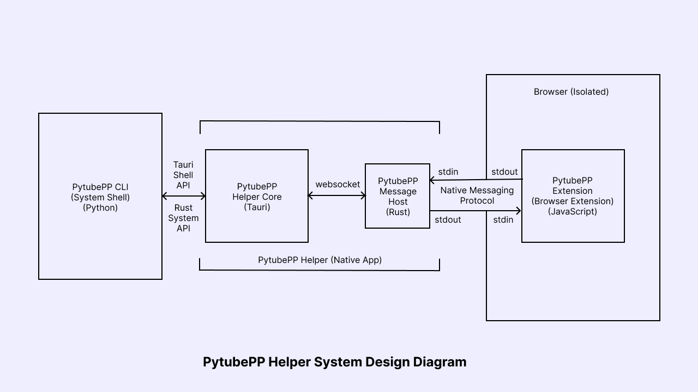

# PytubePP Helper

A Helper App for PytubePP Extension/Addon to Communicate with Pytube Post Processor CLI

[](https://github.com/neosubhamoy/pytubepp-helper)
[](https://github.com/neosubhamoy/pytubepp-helper)
[](https://github.com/neosubhamoy/pytubepp-helper)

#### **🌟 Loved this Project? Don't forget to Star this Repo to show us your appreciation !!**

### 💻 Supported Platforms
- Windows 10 (v1803 or later) / 11
- Linux (Debian / RHEL base) (GNOME only)
- MacOS (v10.13 or later)

### 📎 Pre-Requirements

- [Python](https://www.python.org/downloads/) (>3.8)
- [FFmpeg](https://www.ffmpeg.org)
- [PytubePP](https://github.com/neosubhamoy/pytubepp)
* These requirements can be installed using PytubePP Helper (post installation) if [WinGet](https://learn.microsoft.com/en-us/windows/package-manager/winget/#install-winget) (for Windows users) / [Homebrew](https://brew.sh) (for MacOS users) is installed in your system

### ⬇️ Download and Installation

1. Download the latest release based on your OS and CPU Architecture

| Arch\OS | Windows | Linux | MacOS |
| :----        | :----   | :---- | :---- |
| x64 | ✅ [Download](https://github.com/neosubhamoy/pytubepp-helper/releases/latest) | ✅ [Download](https://github.com/neosubhamoy/pytubepp-helper/releases/latest) | ✅ [Download](https://github.com/neosubhamoy/pytubepp-helper/releases/latest) |
| ARM | ❌ N/A | ❌ N/A | ✅ [Download](https://github.com/neosubhamoy/pytubepp-helper/releases/latest) |

* **>> WINDOWS:**

   1. If you don't have any Pre-Requirements installed first install [WinGet](https://learn.microsoft.com/en-us/windows/package-manager/winget/#install-winget). Then restart your Computer.

   2. Now open PytubePP Helper (from system tray not from start menu or shotcut) you will see (blue) 'install' buttons. First click on the install button on the right side of 'Python', a cmd window will popup to install Python. after the installation is finished then close the cmd window and now install 'FFmpeg' by clicking on the next install button. after the installation is finished close the cmd window and restart your Computer.

   3. Again open PytubePP Helper and install PytubePP at the end. after it finishes you can close the cmd window. Now click on the 'Refresh' button and you will see the 'Ready' message. Then close PytubePP Helper

   4. You can now add the [PytubePP Extension](https://github.com/neosubhamoy/pytubepp-extension) in your browser and it should work properly with [PytubePP](https://github.com/neosubhamoy/pytubepp)

   5. Pro Tips:
   - Make sure PytubePP Helper is always running in the background (system tray) otherwise PytubePP Extension will not work properly.
   - PytubePP Helper by default always autostarts itself when Windows starts. Make sure autostart is not disabled for PytubePP Helper in Task Manager (Startup apps tab)

* **>> LINUX:**

   > NOTE: Not all Debian / RHEL based distros are supported. Supported distros are: debian (tested on v12), ubuntu (tested on v24.04 LTS), pop, kali, rhel, fedora (tested on v40), centos, rocky. If your distro is not in the supported list it doesn't mean that 'the app will not run at all', so, test it yourself and if it doesn't work then you can request us to add support for your distro via creating a github issue.

   > Sandboxed Browsers may not work properly (eg: Flatpak, Snaps) (have issue with: Browser NativeMessaging API [read here](https://github.com/flatpak/xdg-desktop-portal/issues/655))

   1. For linux users Pre-Requirements are mostly fulfilled as 'Python' is pre installed in most linux distros and 'FFmpeg' is auto installed as a dependency  while installing the .deb / .rpm package. You just need to install 'PytubePP' manually by clicking the blue 'install' button opening pytubepp-helper. Now click on the 'Refresh' button and you will see the 'Ready' message. Then close PytubePP Helper.

   > Always make sure your system packages are up-to-date (you may face issues otherwise, the app may not open at all)

   > If you are facing issues with installing 'libwebkit2gtk-4.0' as dependency of pytubepp-helper in Ubuntu 24.04 LTS follow this [guide](https://github.com/tauri-apps/tauri/issues/9662)

   > 'AppIndicator' feature must be enabled for seemless experiance with pytubepp-helper. If your distro doesn't support this by default (eg: fedora) then you need to enable it for your GNOME desktop environment manually, using a GNOME shell extension: [AppIndicator and KStatusNotifierItem Support](https://extensions.gnome.org/extension/615/appindicator-support/)

   2. You can now add the [PytubePP Extension](https://github.com/neosubhamoy/pytubepp-extension) in your browser and it should work properly with [PytubePP](https://github.com/neosubhamoy/pytubepp)

   3. Pro Tips:
   - Make sure PytubePP Helper is always running in the background (Appindicator) otherwise PytubePP Extension will not work properly.
   - PytubePP Helper by default always autostarts itself when Linux Distro starts. Make sure autostart is not disabled for PytubePP Helper in your distro's Startup Manager / Applications

* **>> MAC OS:**
   1. If you don't have any Pre-Requirements installed first install [Homebrew](https://brew.sh)

   2. Python mostly comes pre-installed in MacOS, But on the case if you are running Python version older than 3.8 upgrade it to a newer version using Homebrew command: `brew upgrade python`

   3. Now, open PytubePP Helper app and click on the (blue) install button on the right side of 'FFmpeg' to install it. Also, install 'PytubePP' following the same step.

   4. Then, click on the 'Register' botton on the top right corner to register 'PytubePP Helper' in your system and also add it to your system's autostart entry. If you see a MacOS notification saying 'pytubepp-helper' is added as a startup app then it's done.

   5. Now click on the 'Refresh' button and you will see the 'Ready' message. Then close PytubePP Helper.

   5. You can now add the [PytubePP Extension](https://github.com/neosubhamoy/pytubepp-extension) in your browser and it should work properly with [PytubePP](https://github.com/neosubhamoy/pytubepp)

   6. Pro Tips:
   - Make sure PytubePP Helper is always running in the background (top bar) otherwise PytubePP Extension will not work properly.
   - Always allow all the MacOS security popups if it's from 'pytubepp-helper' otherwise it will not function properly.
   - Don't quit 'pytubepp-helper' from the dock otherwise it will stop working (always use the close button to just hide the app window not fully quit it)
   - PytubePP Helper by default always autostarts itself when MacOS starts. Make sure autostart is not disabled for PytubePP Helper in Settings (General > Login Apps)

### ❔ How It Works

- PytubePP Helper is an intermediate communicator between PytubePP Extension and Pytube Post Processor CLI interface. It is used as a bridge to estblish communication between the System Shell / CMD and Browser Extension, as a Browser Extension can not directly talk (execute commands) with System Shell / CMD for security reasons. Browser Extensions are isolated from the system too, the only way they can communicate with the system (native apps only) is nativeMessaging API provided by Chrome (other Browsers provides it too). So, PytubePP Helper uses that API to communicate with the Browser Extension and recives it's requests and processes the data from PytubePP CLI then genrates a response and sends it to the Browser Extension. For further understanding view the system design diagram of PytubePP Helper app below:



### ⚡ Technologies Used


### 🛠️ Contributing / Building from Source

Want to be part of this? Feel free to contribute...!! Pull Requests are always welcome...!! (^_^) Follow these simple steps to start building:

* Make sure to install Rust, Node.js and Git before proceeding.
* Install tauri [Prerequisites](https://tauri.app/v1/guides/getting-started/prerequisites) for your OS / platform
1. Fork this repo in your github account.
2. Git clone the forked repo in your local machine.
3. Install node dependencies

```code
npm install
```
4. Run development / build process
```code
npm run tauri dev
```
```code
npm run tauri build
```
5. Do the changes, Send a Pull Request with proper Description (NOTE: Pull Requests Without Proper Description will be Rejected)

**⭕ Noticed any Bugs or Want to give us some suggetions? Always feel free to open a GitHub Issue. We would love to hear from you...!!**

### 📝 License

PytubePP Helper is Licensed under the [MIT license](https://github.com/neosubhamoy/pytubepp-helper/blob/main/LICENSE). Anyone can view, modify, use (personal and commercial) or distribute it's sources without any attribution and extra permissions.

⚖️ NOTE: YouTube is a trademark of Google LLC. Use of this trademark is subject to Google Permissions. Downloading and using Copyrighted YouTube Content for Commercial pourposes are not allowed by YouTube Terms without proper Permissions from the Creator. We don't promote this kinds of activity, You should use the downloaded contents wisely and at your own responsibility.